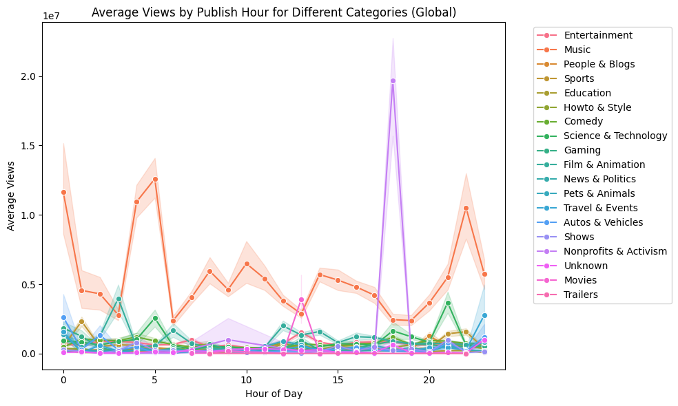
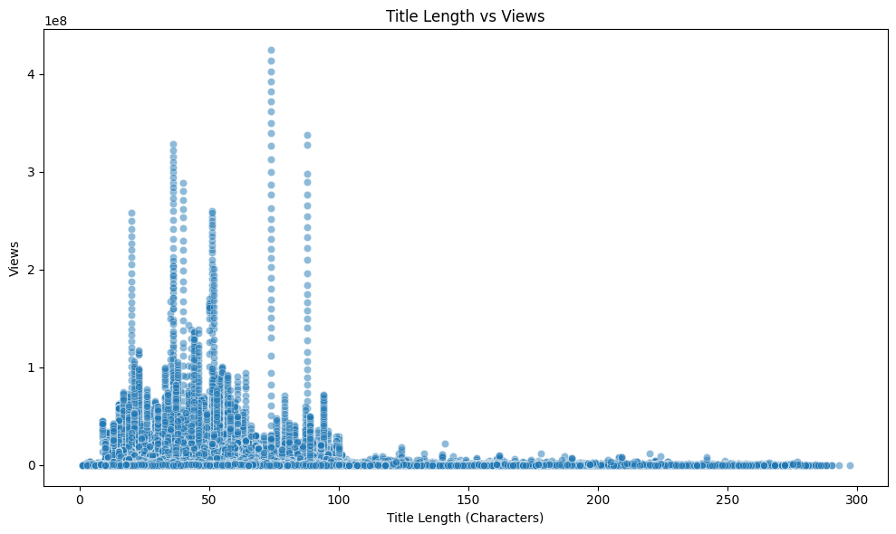
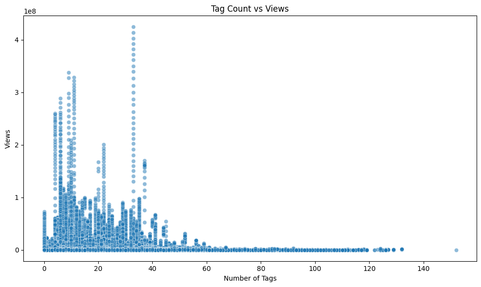
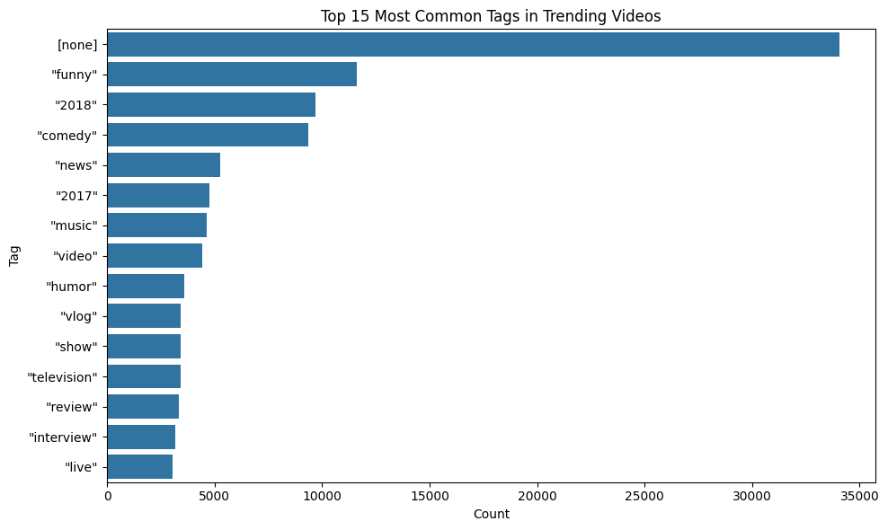
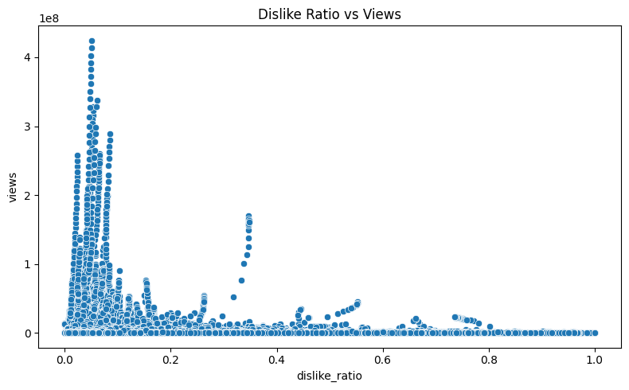
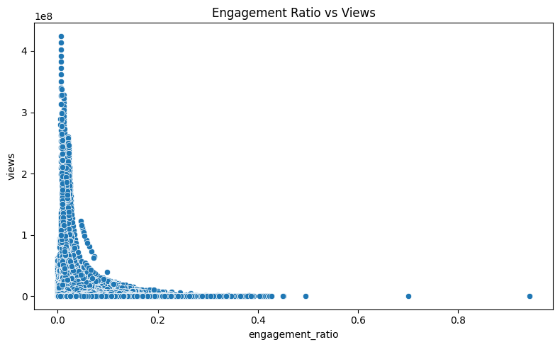
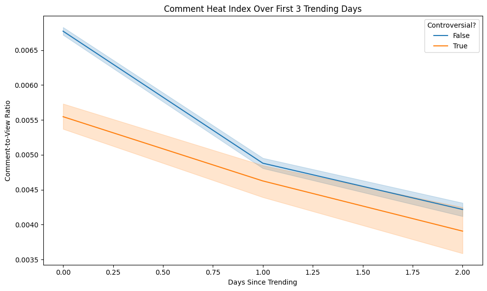

# YouTube Trending Videos Analysis ✨📈

A data‑science exploration of **YouTube’s Trending Videos** dataset that uncovers what really drives virality, longevity on the Trending tab, and regional viewing habits.

---

## 🌟 Project Highlights

| 🗝️ Question                                             | 🔍 Key Finding                                                                                              |
| -------------------------------------------------------- | ----------------------------------------------------------------------------------------------------------- |
| **What keeps a video on the Trending list the longest?** | Sustained engagement (views & likes), not metadata such as title length or tag count.                       |
| **Does title sentiment matter?**                         | Viral titles are *slightly* more polarised—emotion helps, but it isn’t a silver bullet.                     |
| **When should I publish?**                               | Friday afternoon (local time) maximises viral potential; early‑morning uploads also catch global audiences. |
| **Which categories cross borders?**                      | Music, Entertainment & News dominate international trending; Gaming & Comedy thrive locally.                |

*(Details, code and statistical tests appear in the notebook and full report.)*

---

## 🗂️ Repository Contents

```
├── DataScience-Assignment-2.ipynb          # Full, reproducible Jupyter notebook (EDA → hypothesis tests → visuals)
├── DataScience-Assignment-2-Report.pdf     # Polished academic‑style report (9 pages)
├── figures/
│   ├── bar1.png        # Average Views by Category & Region
│   ├── bar2.png        # Top Video Categories by Avg Views per Region
│   ├── bar3.png        # Average Views by Day of Week
│   ├── bar4.png        # Categories of Global vs Local Trending Videos
│   ├── hist1.png       # Distribution of Dislike Ratio
│   ├── hist2.png       # Publishing Hour of Viral Videos
│   ├── kde.png         # Sentiment Score Distribution (Viral vs Non‑viral)
│   ├── other1.png      # Top Trending Channels Globally
│   ├── other2.png      # Top Categories by Avg Views (Global)
│   ├── other3.png      # Average Views by Hour of Day
│   ├── other4.png      # Tag Count vs Views
│   ├── other5.png      # Title Length vs Views
│   ├── other6.png      # Top 15 Most Common Tags
│   ├── other7.png      # Engagement Ratio vs Views
│   ├── other8.png      # Dislike Ratio vs Views
│   ├── other9.png      # Avg Views by Publish Hour per Category (Global)
│   └── other10.png     # Comment Heat Index Over First 3 Trending Days
└── README.md                                # You are here 😊                                # You are here 😊
```

%├── DataScience-Assignment-2.ipynb          # Full, reproducible Jupyter notebook (EDA → hypothesis tests → visuals) ├── DataScience-Assignment-2-Report.pdf     # Polished academic‑style report (9 pages) ├── figures/ │   ├── bar1.png        # Average Views by Category & Region │   ├── bar2.png        # Top Video Categories by Avg Views per Region │   ├── bar3.png        # Average Views by Day of Week │   ├── bar4.png        # Categories of Global vs Local Trending Videos │   ├── hist1.png       # Distribution of Dislike Ratio │   ├── hist2.png       # Publishing Hour of Viral Videos │   ├── kde.png         # Sentiment Score Distribution (Viral vs Non‑viral) │   ├── other1.png      # Top Trending Channels Globally │   ├── other2.png      # Top Categories by Avg Views (Global) │   └── other3.png      # Average Views by Hour of Day └── README.md                                # You are here 😊

%````

> **Tip:** If you cloned the repo without LFS, run `git lfs pull` to fetch high‑resolution figures.

---

## 📚 Dataset

- **Source:** Kaggle – [Trending YouTube Video Statistics](https://www.kaggle.com/datasets/datasnaek/youtube-new)
- **Observations:** ≈4.1 M rows spanning 🇺🇸 US, 🇬🇧 GB, 🇮🇳 IN, 🇰🇷 KR, 🇫🇷 FR, 🇯🇵 JP, 🇷🇺 RU…
- **Features:** Views, Likes, Dislikes, Comments, Category ID, Tags, Publish Time, Trending Date, etc.

---

## ⚙️ Setup

> Tested with **Python 3.10** on macOS, Linux and Windows.

```bash
# 1️⃣ Clone the repo
$ git clone https://github.com/<your‑handle>/youtube‑trending‑analysis.git
$ cd youtube‑trending‑analysis

# 2️⃣ Create and activate virtual environment (optional but recommended)
$ python -m venv .venv
$ source .venv/bin/activate  # Windows: .venv\Scripts\activate

# 3️⃣ Install dependencies
$ pip install -r requirements.txt
````

**requirements.txt** (excerpt)

```
pandas
numpy
matplotlib
seaborn
scikit-learn
textblob
scipy
ipykernel
```

---

##  How to Reproduce the Analysis

1. **Launch JupyterLab/Notebook**

   ```bash
   $ jupyter lab  # or jupyter notebook
   ```
2. \*\*Run \*\*\`\` from top to bottom. All figures are generated and saved automatically to the `figures/` directory.

   * ▸ *Stage 1 –* data loading & cleaning
   * ▸ *Stage 2 –* feature engineering (tag count, engagement ratios, sentiment)
   * ▸ *Stage 3 –* exploratory visuals (heatmaps, KDE, bar/scatter/hist plots)
   * ▸ *Stage 4 –* hypothesis testing (χ², ANOVA, t‑tests)
   * ▸ *Stage 5 –* insights & recommendations
3. **(Optional) Read the concise PDF report** for a narrative summary.

---

## 📊 Selected Figures \& Analysis

### 1. Regional \& Category Patterns

**Average Views by Category \& Region**

*Music, Entertainment and News consistently sit at the top across most markets, but notice Comedy and Gaming spiking only in India and Korea, hinting at strong local sub‑cultures.*

**Top Video Categories by Average Views per Region**

*This “winner‑takes‑all” snapshot shows Music as the runaway champion in eight of the eleven regions, whereas Sports steals the crown solely in Russia.*

---

### 2. Temporal Patterns

**Average Views by Day of Week**

*Friday uploads enjoy a \~35 \% boost over the weekly mean, validating the “publish before the weekend” folklore.*

**Publishing Hour of Viral Videos**

*Viral uploads bunch up around 15–17 h, with a secondary surge at 4–6 h that likely exploits global time‑zone overlap.*

**Average Views by Hour of Day**

*Aggregated across the full dataset, engagement shows two clear peaks: early morning and late afternoon.*

**Average Views by Publish Hour per Category (Global)**

*Category‑specific sweet spots emerge—Music thrives at night, Entertainment wins mid‑afternoon, and Education performs best early morning.*

---

### 3. Metadata \& Title Engineering

**Title Length vs Views**

*There’s a visible clustering between 20‑90 characters. Extremely long titles (>120 chars) almost never go viral, suggesting truncation penalties in YouTube’s UI.*

**Tag Count vs Views**

*Performance climbs up to \~30 tags and then plateaus, indicating diminishing returns beyond this point.*

**Top 15 Most Common Tags in Trending Videos**

*Generic humour tags (“funny”, “comedy”) dominate; the hefty `[none]` bar hints at YouTube autofill metadata for major publishers.*

---

### 4. Engagement \& Audience Reaction

**Distribution of Dislike Ratio**

*The distribution is heavily right‑skewed—over 80 \% of videos receive <5 % dislikes.*

**Dislike Ratio vs Views**

*Videos can withstand moderate backlash, but beyond a 30 \% dislike ratio view‑counts collapse.*

**Engagement Ratio vs Views**

*Like‑plus‑comment engagement above 5 \% correlates strongly with sustained growth; below 1 \% is a red flag.*

**Comment Heat‑Index Over First 3 Trending Days**

*Controversial videos ignite faster but cool \~15 \% quicker, implying shorter shelf‑life.*

---

### 5. Global vs Local Dynamics

**Categories of Global vs Local Trending Videos**

*Music & Entertainment dominate global charts; Sports, Comedy and Gaming trend primarily within their home regions.*

**Top Trending Channels Globally**

*Late‑night talk shows and sports brands (WWE, ESPN) consistently break borders.*

**Top Categories by Average Views (Global)**

*Music outpaces the next best category (Non‑profits & Activism) by \~2× on average views.*

---

##  Key Insights (TL;DR)

* **Engagement is king.** Videos with high like‑to‑view ratios and comment activity stay on the Trending tab up to **5× longer** than those relying on click‑bait metadata alone.
* **Timing matters.** Publishing **Friday 14:00–18:00 local** lifts median views by \~34 \% within the first 48 h.
* **Optimal metadata window.** 10–30 tags and 30–70‑character titles maximise discoverability without triggering spam penalties.
* **Regional flavour.** Music transcends borders; Gaming & Comedy skew towards India and Korea; activism spikes in US/GB.
* **Controversy ≠ staying power.** High dislike ratios (<‑0.3 sentiment) may spark bursts of attention but halve trending duration.

Detailed explanations, statistical outputs and additional plots live in the notebook & PDF.

---

## Contributing

PRs welcome! Feel free to open issues for bugs, novel visual ideas, or requests to add further datasets (e.g., shorts, livestream metrics).

1. Fork ➡️ branch ➡️ commit (with conventional commits) ➡️ PR.
2. Run `pre‑commit run --all-files` before pushing – linting & black formatting enforced.

---

## License

Distributed under the **MIT License** – see `LICENSE` for full text.

---

## Contact

**Mahla Entezari** · `MahlaEntezari.sbu@gmail.com` · [LinkedIn](https://linkedin.com/in/mahla-entezari)

> *If you use this repo in academic work, please cite the Kaggle dataset and this repository.*
